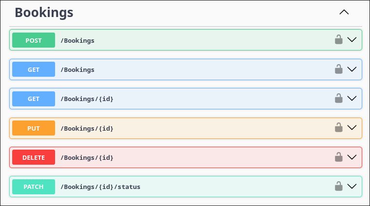

# Allocella - Backend



<div style="text-align: center">

   </div>

This repository contains the **back-end** program of the Allocella app. This program provides API that bridges the backend validation and [database](https://github.com/Quackeyikz/2026-Allocella-infrastructure), to the [frontend](https://github.com/Quackeyikz/2026-Allocella-frontend). To see the main docs of Allocella, see [Allocella Docs](https://github.com/Quackeyikz/2026-Allocella-docs)
_Sorry I didn't document it in Swagger properly using descriptions and summaries_.

> Educational purpose only.

## Tech Stacks

<div style="text-align: center">


</div>

- ASP.NET Core 8.0
- Implements REST API
- Entity Framework Core v8.0.0 (ORM)
- EF Core PostgreSQL Provider (database driver)
- EF Core Design Tools (for migrations)

## How to Run?

1. Turn the [infrastructure](https://github.com/Quackeyikz/2026-Allocella-infrastructure) on using `docker-compose up -d`, or alternatively: a local database **is running**.
2. Clone this repository.
3. `cd 2026-Allocella-backend/AllocellaAPI`
4. `cp .env.example .env`, Fill in the variables, match it with your database.
5. `dotnet restore`
6. `dotnet install --global dotnet-ef`
7. `dotnet ef database update`
8. `dotnet build`
9. `dotnet run`
10. To access the Swagger, go to: `http://[Your API URL]/swagger`

## Commands Used Docummentation
1. ASP.NET WebAPI Initialization (Using v8.0)

    ```bash
    dotnet new webapi -n AllocellaAPI -controllers -f net8.0
    ```

2. Installing EF Core v8.0.0

    ```bash
    dotnet add package Microsoft.EntityFrameworkCore --version 8.0.0
    ```

3. Installing EF Core PostgreSQL Provider

    ```bash
    dotnet add package Npgsql.EntityFrameworkCore.PostgreSQL --version 8.0.0
    ```

4. Installing EF Core Design Tools

    ```bash
    dotnet add package Microsoft.EntityFrameworkCore.Design --version 8.0.0
    ```

5. Install DotNetEnv to detect ENV file in ASP.NET

    ```bash
    dotnet add package DotNetEnv
    ```

6. (Global) Install EF Core Command Line Tools (for easier access)

    ```bash
    dotnet install --global dotnet-ef
    ```

7. Migration

    ```bash
    dotnet ef migrations add InitialCreate
    ```

    (To remove, use 'ef migrations remove')

    ```bash
    dotnet ef database update
    ```

8. [BCrypt.Net](https://www.nuget.org/packages/BCrypt.Net-Next/) for Password Hashing

    ```bash
    dotnet add package BCrypt.Net-Next
    ```

9. JWT Libary (Using 8.16.0 at the time of writing)

    ```bash
    dotnet add package System.IdentityModel.Tokens.Jwt
    ```

    JWT Bearer

    ```bash
    dotnet add package Microsoft.AspNetCore.Authentication.JwtBearer --version 8.0.0
    ```

10. OpenApi Package (A bit late, but better than never)

    ```bash
    dotnet add package Microsoft.OpenApi --version 1.6.14
    ```

### Migrations Commands (For Note)
**Generate a new migration**

    ```bash
    dotnet ef migrations add <MigrationName>
    ```

**Apply all pending migrations**

    ```bash
    dotnet ef database update
    ```

**Apply migrations up to a specific one**

    ```bash
    dotnet ef database update <MigrationName>
    ```

**Rollback to previous migration**

    ```bash
    dotnet ef database update <PreviousMigrationName>
    ```

**Remove last migration (if not applied yet)**

    ```bash
    dotnet ef migrations remove
    ```

**List all migrations**

    ```bash
    dotnet ef migrations list
    ```

**Generate SQL script (without applying)**

    ```bash
    dotnet ef migrations script
    ```

**Drop database (DANGER!)**

    ```bash
    dotnet ef database drop
    ```

## Frequently Asked Questions (by myself)
- Q: How to configure DbConnect, DbSet, and all that?
- A: I refer to [this tutorial](https://www.c-sharpcorner.com/article/building-a-powerful-asp-net-core-web-api-with-postgresql/) using EntityFrameworkCore (EF).
  
- Q: How is the database environment looked like?
- A: .env variables -> Containerized DB (From docker image creation).

## Contribution

Author: Quackeyikz  

> The Budget Programmer
> _I'm more into Frontend anyway._